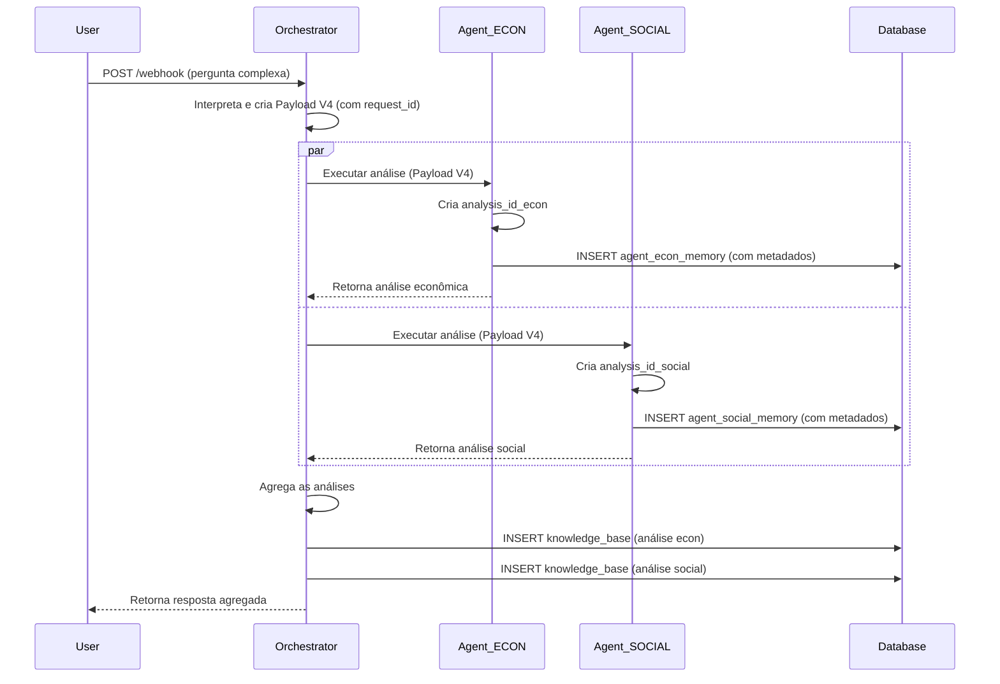

# Arquitetura V4: IDs Semânticos e Metadados Estruturados

**Data:** 08/12/2025  
**Sessão:** #13  
**Autores:** Henrique, Manus AI

## 1. Resumo Executivo

A Arquitetura V4 representa uma evolução fundamental no design do sistema, movendo-o de um pipeline reativo para um **ecossistema de análise inteligente e auditável**. Esta arquitetura introduz um sistema de **IDs Semânticos** para rastreabilidade e **Metadados Estruturados** para permitir análises complexas sobre o próprio funcionamento do sistema. Ela foi projetada para suportar nativamente análises **multidimensionais** e **multiterritoriais**.

## 2. Componentes da Arquitetura

### 2.1. Estrutura de Identificadores

| ID | Responsável | Geração | Formato | Exemplo |
| :--- | :--- | :--- | :--- | :--- |
| `request_id` | Orquestrador | Início da requisição | `"{timestamp}-req-{id_territorio_principal}"` | `"20251208-req-1721000"` |
| `analysis_id` | Agente | Início da tarefa | `"{request_id}-{dimension}"` | `"20251208-req-1721000-economic"` |

### 2.2. Estrutura de Metadados

Os seguintes campos foram adicionados a todas as tabelas de armazenamento (`knowledge_base` e `agent_*_memory`):

| Campo | Tipo de Dado | Descrição | Exemplo |
| :--- | :--- | :--- | :--- |
| `request_id` | `character varying` | Chave estrangeira para a requisição original. | `"20251208-req-1721000"` |
| `analysis_scope` | `character varying` | `unidimensional` ou `multidimensional`. | `"multidimensional"` |
| `territory_scope` | `character varying` | `uniterritorial` ou `multiterritorial`. | `"multiterritorial"` |
| `dimensions` | `text[]` | Array com as dimensões da análise. | `ARRAY["economic", "social"]` |
| `territories` | `jsonb` | Array de objetos com os territórios. | `[{"id": "1721000", "name": "Palmas"}]` |

## 3. Fluxo de Dados Detalhado

1.  **Recebimento (Orquestrador):** O webhook recebe a pergunta do usuário.
2.  **Interpretação (Orquestrador):** Um modelo de LLM (GPT-4.1-mini) analisa a pergunta e extrai os escopos, dimensões e territórios em formato JSON estruturado.
3.  **Enriquecimento (Orquestrador):** Um nó "Set" cria o `request_id` e combina a entrada original com os metadados interpretados, formando um **Payload V4** completo.
4.  **Roteamento (Orquestrador):** O roteador inteligente decide para quais agentes enviar o Payload V4 (pode ser mais de um).
5.  **Execução (Agentes):**
    *   Cada agente recebe o Payload V4.
    *   Cria seu próprio `analysis_id` único.
    *   Executa a análise solicitada (que pode ser para múltiplos territórios).
    *   Salva o resultado em sua memória local, preenchendo todos os campos de metadados.
    *   Retorna o resultado completo (incluindo `analysis_id` e todos os metadados) para o Orquestrador.
6.  **Agregação (Orquestrador):**
    *   O Orquestrador aguarda a resposta de todos os agentes acionados.
    *   Ele então agrega as diferentes análises dimensionais em uma resposta final e coesa para o usuário.
    *   Salva cada análise individual recebida dos agentes na `knowledge_base`.
7.  **Resposta (Orquestrador):** Envia a resposta agregada final para o usuário.

## 4. Diagrama de Sequência

## 5. Impacto e Benefícios

*   **Preparado para o Futuro:** Suporta nativamente os casos de uso mais complexos.
*   **Inteligência de Sistema:** Permite analisar o próprio desempenho e os tipos de perguntas mais comuns.
*   **Rastreabilidade Completa:** Facilita a depuração e a auditoria de qualquer análise.
*   **Clareza Arquitetural:** Define responsabilidades claras entre o Orquestrador e os Agentes.
