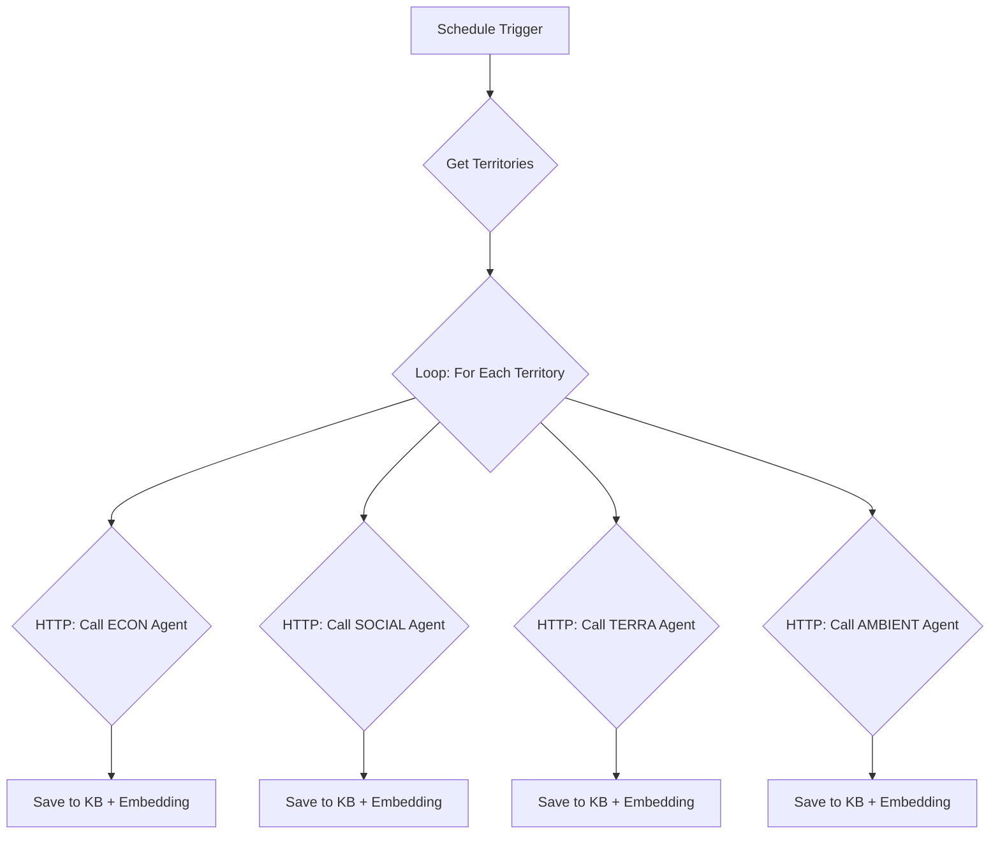

# Estratégia para Popular a Tabela `knowledge_base`

## 🎯 Objetivo

Popular a tabela `knowledge_base` com análises de alta qualidade geradas por IA para cada um dos 140 territórios nas 4 dimensões, criando uma base de conhecimento rica para alimentar o dashboard e habilitar funcionalidades avançadas como RAG (Retrieval-Augmented Generation).

---

## 📊 Situação Atual

- **Tabela:** `knowledge_base`
- **Registros:** 0
- **Impacto:** Crítico. Sem ela, o sistema não tem "memória", as análises são lentas (geradas em tempo real) e funcionalidades de IA avançada são impossíveis.

---

## 📋 Estratégia Proposta: Geração Híbrida (Lote + Sob Demanda)

### **Visão Geral:**

1.  **Geração em Lote (Batch):** Pré-processar análises para um subconjunto prioritário de territórios (ex: os 20 maiores) para garantir performance imediata nos casos de uso mais comuns.
2.  **Geração Sob Demanda com Cache:** Para os demais territórios, gerar a análise na primeira vez que for solicitada e salvá-la (cache) na `knowledge_base` para acessos futuros instantâneos.
3.  **Geração de Embeddings:** Para cada análise salva, gerar e armazenar um vetor de embedding para habilitar buscas semânticas (RAG).

### **Vantagens:**
- ✅ **Performance Imediata:** As análises mais importantes estarão prontas instantaneamente.
- ✅ **Custo-Benefício:** Evita o custo de gerar 2.240 análises de uma só vez, distribuindo o processamento ao longo do tempo.
- ✅ **Escalabilidade:** O sistema se torna mais inteligente a cada uso, completando a base de conhecimento organicamente.
- ✅ **Experiência do Usuário:** Combina a rapidez do cache com a cobertura completa da geração sob demanda.

---

## 🚀 Passo-a-Passo da Implementação

### **Passo 1: Criar Workflow de Geração em Lote**

**Objetivo:** Automatizar a geração de análises para um grupo de territórios.

**Ferramenta:** n8n (reaproveitando os agentes especialistas já criados).

**Novo Workflow: `WF-BATCH-ANALYSIS-GENERATOR`**



**Lógica do Workflow:**
1.  **Get Territories:** Busca no banco a lista de territórios a serem processados (ex: `SELECT id, name FROM territories WHERE population > 50000`).
2.  **Loop:** Itera sobre cada território.
3.  **Call Agent:** Para cada dimensão, faz uma chamada POST para o webhook do agente especialista correspondente, enviando o `territory_id`.
4.  **Save to KB:** Recebe a análise do agente e a insere na tabela `knowledge_base`.
5.  **Embedding:** Após a inserção, gera o embedding do texto da análise e o atualiza na tabela.

---

### **Passo 2: Implementar Geração e Cache Sob Demanda**

**Objetivo:** Modificar o fluxo de análise do dashboard para que ele consulte a `knowledge_base` antes de chamar um agente.

**Lógica do Backend (Orquestrador):**

```python
def get_analysis(territory_id, dimension):
    # 1. Tenta buscar no cache (knowledge_base)
    analysis = db.query("SELECT content FROM knowledge_base WHERE territory_id = ? AND dimension = ?", (territory_id, dimension))
    
    if analysis:
        # 2. Se encontrou, retorna a análise do cache
        return analysis.content
    else:
        # 3. Se não encontrou, chama o agente especialista
        new_analysis = call_agent(territory_id, dimension)
        
        # 4. Salva a nova análise no cache
        db.execute("INSERT INTO knowledge_base (territory_id, dimension, content) VALUES (?, ?, ?)", (territory_id, dimension, new_analysis))
        
        # 5. Gera e salva o embedding (em background)
        generate_embedding_async(new_analysis)
        
        # 6. Retorna a nova análise
        return new_analysis
```

---

### **Passo 3: Gerar Embeddings para RAG**

**Objetivo:** Transformar cada análise textual em um vetor numérico para buscas por similaridade.

**Script:** `generate_embeddings.py` (pode ser um passo no workflow n8n ou um script separado)

```python
import os
import psycopg2
from openai import OpenAI
from pgvector.psycopg2 import register_vector

client = OpenAI(api_key=os.getenv("OPENAI_API_KEY"))

# Conectar ao DB com pgvector
conn = psycopg2.connect(os.getenv("DATABASE_URL"))
register_vector(conn)
cur = conn.cursor()

# Buscar análises sem embedding
cur.execute("SELECT id, content FROM knowledge_base WHERE embedding IS NULL")
analyses_to_process = cur.fetchall()

for analysis_id, content in analyses_to_process:
    # Gerar embedding com a API da OpenAI
    response = client.embeddings.create(
        input=content,
        model="text-embedding-ada-002" # Modelo padrão e de baixo custo
    )
    embedding = response.data[0].embedding
    
    # Salvar o embedding no banco
    cur.execute("UPDATE knowledge_base SET embedding = %s WHERE id = %s", (embedding, analysis_id))
    print(f"✓ Embedding gerado para a análise {analysis_id}")

conn.commit()
print(f"\n✓ {len(analyses_to_process)} embeddings gerados e salvos.")
```

---

## ⏰ Cronograma e Priorização

| Fase | Duração | Custo (OpenAI) | Prioridade |
|------|---------|----------------|------------|
| 1. **Batch Top 20** | 1h (setup) + 30min (exec) | ~$0.08 | **ALTA** |
| 2. **Implementar Cache** | 2-3 horas (dev) | $0 | **ALTA** |
| 3. **Batch Completo** | 3-4 horas (exec) | ~$0.56 | MÉDIA |
| 4. **Gerar Embeddings** | 1h (setup) + 1h (exec) | ~$0.02 | MÉDIA |
| 5. **Implementar RAG** | 4-6 horas (dev) | $0 | BAIXA |

**Recomendação:** Começar com a **Fase 1 (Batch Top 20)** e a **Fase 2 (Implementar Cache)**. Isso resolve 80% do problema de performance com 20% do esforço.

---

## 🚀 Plano de Ação Imediato

### **1. Criar o Script de Geração em Lote**

**Arquivo:** `batch_generate_analyses.py`

Este script Python servirá como um protótipo para o workflow n8n e pode ser usado para a geração inicial.

```python
# batch_generate_analyses.py
import requests
import psycopg2
import os
import time
import json

# Conectar ao DB
conn = psycopg2.connect(os.getenv("DATABASE_URL"))
cur = conn.cursor()

# Buscar os 20 territórios mais populosos
cur.execute("""
    SELECT t.id, t.name FROM territories t
    JOIN social_indicators si ON t.id = si.territory_id
    WHERE t.type = 'Município' AND si.year = 2023
    ORDER BY si.population DESC
    LIMIT 20;
""")
territories = cur.fetchall()

# Webhooks dos agentes
agents = {
    'economic': 'https://.../agent-econ',
    'social': 'https://.../agent-social',
    'territorial': 'https://.../agent-terra',
    'environmental': 'https://.../agent-ambient'
}

for territory_id, territory_name in territories:
    print(f"\n=== Processando: {territory_name} ===")
    for dimension, webhook_url in agents.items():
        print(f"  Dimensão: {dimension}...", end=" ")
        try:
            response = requests.post(webhook_url, json={'territory_id': territory_id, 'analysis_type': 'diagnostic'}, timeout=30)
            if response.status_code == 200:
                analysis = response.json()
                cur.execute("""
                    INSERT INTO knowledge_base (territory_id, dimension, analysis_type, content, metadata)
                    VALUES (%s, %s, %s, %s, %s)
                    ON CONFLICT (territory_id, dimension, analysis_type) DO UPDATE SET
                        content = EXCLUDED.content,
                        updated_at = NOW();
                """, (territory_id, dimension, 'diagnostic', analysis.get('analysis'), json.dumps(analysis.get('metadata', {}))))
                conn.commit()
                print("✓ Análise salva.")
            else:
                print(f"✗ Erro {response.status_code}")
        except requests.exceptions.RequestException as e:
            print(f"✗ Erro de conexão: {e}")
        time.sleep(2) # Evitar sobrecarga

print(f"\n✓ Análises em lote geradas para {len(territories)} territórios.")
```

### **2. Executar o Script no Replit**

1.  Salvar o script acima no Replit.
2.  Instalar a dependência: `pip install requests`.
3.  Definir as URLs corretas dos webhooks dos agentes.
4.  Executar: `python batch_generate_analyses.py`.

---

## 🎯 Resultado Esperado

- A tabela `knowledge_base` será populada com aproximadamente 80 análises (20 territórios × 4 dimensões).
- O dashboard se tornará instantaneamente rápido para os 20 municípios mais importantes.
- Teremos uma prova de conceito funcional para a geração de conhecimento em lote e o sistema de cache.

---

**Framework de Inteligência Territorial V6.0**  
Henrique M. Ribeiro  
23 de novembro de 2025
