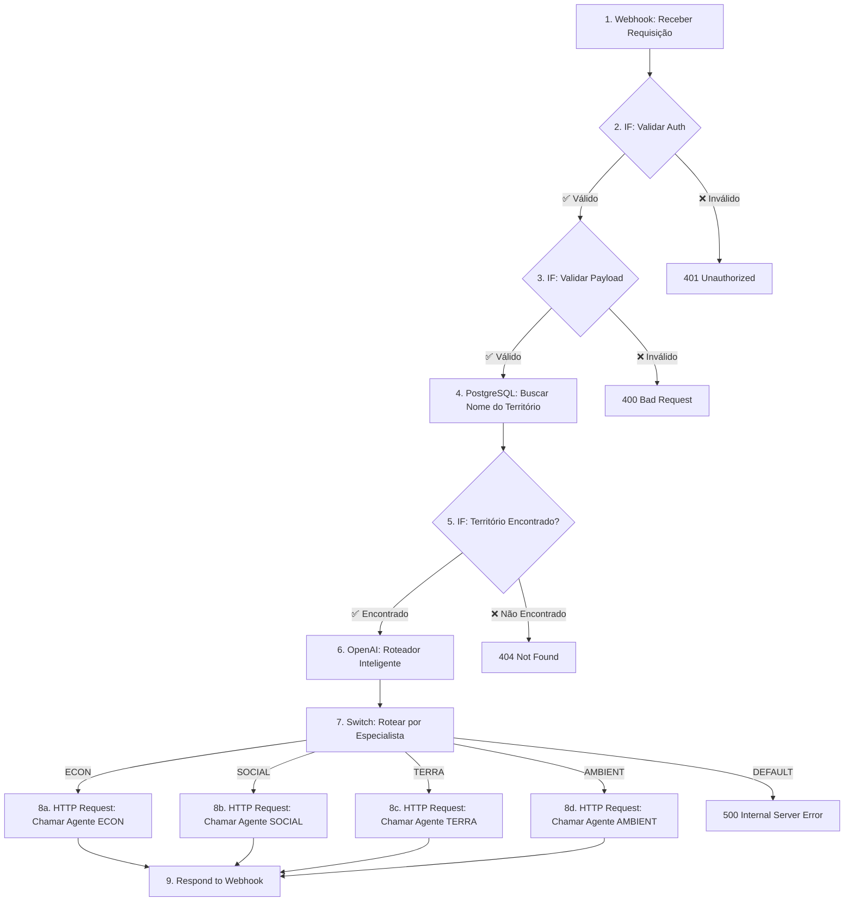

# Especificação Técnica: Workflow do Agente Orquestrador

**Framework de Inteligência Territorial V6.0**  
**Data:** 01/12/2025  
**Autor:** Manus AI  
**Versão:** 1.0.0

---

## 🎯 1. RESUMO EXECUTIVO

Este documento detalha o **primeiro passo prático** para a implementação do Agente Orquestrador: o **design completo do seu workflow no n8n**. Ele serve como um "blueprint" para a construção, definindo cada nó, a lógica de fluxo, os contratos de API, as validações e o tratamento de erros.

O objetivo é criar um workflow robusto, escalável e de fácil manutenção que atue como o "coordenador do time" no Núcleo de Especialistas (Camada 2), recebendo solicitações do Agente Concierge (Camada 1) e orquestrando a geração de análises profundas.

---

## 🏛️ 2. PRINCÍPIOS DE DESIGN

O workflow será construído seguindo 4 princípios fundamentais:

1.  **Single Responsibility (Responsabilidade Única):** O Orquestrador tem **uma única função**: receber uma pergunta, identificar o especialista correto e acioná-lo. Ele **não** gera análises, **não** interage com o usuário final e **não** salva a análise final no banco (essa é a responsabilidade do especialista).
2.  **Stateless (Sem Estado):** O Orquestrador não armazena nenhuma informação entre execuções. Cada solicitação é tratada de forma independente, garantindo escalabilidade e previsibilidade.
3.  **Idempotent (Idempotente):** Se o Concierge enviar a mesma requisição duas vezes, o resultado final será o mesmo (uma única análise no banco), evitando duplicidade. O Orquestrador não verificará a existência da análise, mas os agentes especialistas sim.
4.  **Fail Fast (Falha Rápida):** O workflow deve validar os dados de entrada no início e falhar imediatamente se informações críticas estiverem faltando, economizando recursos e fornecendo feedback rápido.

---

## 📜 3. CONTRATO DE API (API CONTRACT)

Esta é a "promessa" que o Orquestrador faz ao seu cliente, o Agente Concierge.

### Endpoint

-   **URL:** `[URL do Webhook do n8n]`
-   **Método:** `POST`
-   **Autenticação:** Header `Authorization: Bearer [TOKEN_SECRETO]` (para garantir que apenas o Concierge possa acioná-lo)

### Request Body (Entrada)

O Orquestrador espera receber um JSON com a seguinte estrutura:

```json
{
  "territory_id": "1721000",
  "question": "Qual o impacto do crescimento populacional na economia de Palmas?"
}
```

| Campo | Tipo | Obrigatório | Descrição |
| :--- | :--- | :--- | :--- |
| `territory_id` | `string` | ✅ Sim | O código IBGE do município (7 dígitos) sobre o qual a análise é solicitada. |
| `question` | `string` | ✅ Sim | A pergunta original do usuário, em linguagem natural. Usada para roteamento. |

### Response Body (Saída)

#### Resposta de Sucesso (200 OK)

O Orquestrador retorna a análise completa gerada pelo especialista, sem modificações.

```json
{
  "analysis_id": "uuid-da-analise-gerada",
  "territory_id": "1721000",
  "territory_name": "Palmas",
  "agent_id": "econ",
  "generated_at": "2025-12-01T14:30:00Z",
  "analysis_text": "A economia de Palmas, capital do Tocantins, tem sido fortemente influenciada pelo seu rápido crescimento populacional... [texto completo da análise] ..."
}
```

#### Resposta de Erro

| Código HTTP | Situação | Exemplo de Resposta |
| :--- | :--- | :--- |
| `400 Bad Request` | Dados de entrada inválidos (ex: `territory_id` faltando) | `{"error": "Bad Request", "message": "O campo 'territory_id' é obrigatório."}` |
| `401 Unauthorized` | Token de autenticação inválido ou ausente | `{"error": "Unauthorized", "message": "Token de autenticação inválido."}` |
| `404 Not Found` | `territory_id` não encontrado no banco de dados | `{"error": "Not Found", "message": "Território com ID '9999999' não encontrado."}` |
| `500 Internal Server Error` | Falha em qualquer etapa interna (ex: LLM não respondeu) | `{"error": "Internal Server Error", "message": "Falha ao rotear a pergunta para um especialista."}` |

---

## 🌊 4. DIAGRAMA DO WORKFLOW (NÓS DO N8N)

Este é o fluxo de nós que implementaremos no n8n para executar a lógica do Orquestrador.



---

## ⚙️ 5. DETALHAMENTO DOS NÓS

### **1. Webhook: Receber Requisição**
- **Tipo:** `Webhook`
- **Configuração:**
  - **HTTP Method:** `POST`
  - **Authentication:** `Header Auth`
  - **Credential:** Criar nova credencial `Header Auth` com o token secreto.
  - **Path:** Será gerado automaticamente pelo n8n.

### **2. IF: Validar Autenticação**
- **Tipo:** `IF`
- **Condição:** Verifica se a credencial foi validada pelo nó Webhook. (O n8n faz isso implicitamente, mas podemos adicionar uma verificação extra se necessário).
- **Saída TRUE:** Continua o fluxo.
- **Saída FALSE:** Conecta a um nó `Respond to Webhook` com status `401 Unauthorized`.

### **3. IF: Validar Payload**
- **Tipo:** `IF`
- **Condições (AND):**
  - `{{$json.body.territory_id}}` -> `Is Not Empty`
  - `{{$json.body.question}}` -> `Is Not Empty`
- **Saída TRUE:** Continua o fluxo.
- **Saída FALSE:** Conecta a um nó `Respond to Webhook` com status `400 Bad Request` e mensagem de erro apropriada.

### **4. PostgreSQL: Buscar Nome do Território**
- **Tipo:** `Postgres`
- **Credential:** Credenciais do banco de dados Neon.
- **Operation:** `Execute Query`
- **Query:**
  ```sql
  SELECT name FROM territories WHERE ibge_code = '{{$json.body.territory_id}}';
  ```
- **Objetivo:** Enriquecer o payload com o nome do território, que será usado no prompt do roteador e no payload para o especialista.

### **5. IF: Território Encontrado?**
- **Tipo:** `IF`
- **Condição:** Verifica se a query anterior retornou algum resultado.
  - `{{$node["PostgreSQL"].json.name}}` -> `Is Not Empty`
- **Saída TRUE:** Continua o fluxo.
- **Saída FALSE:** Conecta a um nó `Respond to Webhook` com status `404 Not Found`.

### **6. OpenAI: Roteador Inteligente**
- **Tipo:** `OpenAI Chat Model`
- **Credential:** Chave da API da OpenAI.
- **Model:** `gpt-4o-mini` (para velocidade e custo)
- **Prompt:**
  ```
  Você é um roteador de tarefas para um sistema de IA com 4 agentes especialistas. Sua única função é ler a pergunta do usuário e retornar, em uma única palavra, o ID do agente mais apropriado para responder.

  Os agentes disponíveis são:
  - econ: Especialista em economia, PIB, emprego, renda, setores produtivos.
  - social: Especialista em sociedade, IDHM, educação, saúde, demografia, desigualdade.
  - terra: Especialista em território, urbanização, infraestrutura, saneamento, mobilidade.
  - ambient: Especialista em meio ambiente, desmatamento, recursos hídricos, clima, sustentabilidade.

  Retorne APENAS o ID do agente (econ, social, terra, ambient). Não adicione nenhuma outra palavra ou pontuação.

  --- 

  **Pergunta do Usuário:** "{{$json.body.question}}"
  **Território:** "{{$node["PostgreSQL"].json.name}}"
  ```
- **Objetivo:** Classificar a pergunta do usuário e obter o `agent_id` para o roteamento.

### **7. Switch: Rotear por Especialista**
- **Tipo:** `Switch`
- **Input:** `{{$node["OpenAI Chat Model"].json.choices[0].message.content}}` (a saída do LLM)
- **Routing Rules:**
  - **Output 1:** `Equals` -> `econ`
  - **Output 2:** `Equals` -> `social`
  - **Output 3:** `Equals` -> `terra`
  - **Output 4:** `Equals` -> `ambient`
- **Default Output:** Conecta a um nó de erro `500 Internal Server Error` (caso o LLM retorne algo inesperado).

### **8. HTTP Request: Chamar Agentes (x4)**
- **Tipo:** `HTTP Request` (um nó para cada especialista)
- **Configuração (Exemplo para ECON):**
  - **URL:** `[URL do Webhook do Agente ECON]`
  - **Method:** `POST`
  - **Authentication:** `Header Auth` (se os agentes também forem protegidos)
  - **Body Content Type:** `JSON`
  - **Body:**
    ```json
    {
      "agent_id": "econ",
      "territory_id": "{{$json.body.territory_id}}",
      "territory_name": "{{$node['PostgreSQL'].json.name}}",
      "analysis_type": "comprehensive"
    }
    ```
- **Objetivo:** Acionar o workflow do especialista apropriado com um payload completo e validado.

### **9. Respond to Webhook**
- **Tipo:** `Respond to Webhook`
- **Configuração:**
  - **Response Code:** `200`
  - **Response Data:** `{{$node["HTTP Request"].json}}` (retorna a resposta do agente especialista)
- **Objetivo:** Devolver a análise gerada para o Agente Concierge.

---

## 🚀 6. PRÓXIMOS PASSOS

1.  **Validação:** Apresentar este documento para sua aprovação.
2.  **Credenciais:** Obter as credenciais necessárias (n8n, Neon, OpenAI).
3.  **Implementação:** Construir o workflow no n8n seguindo exatamente esta especificação.
4.  **Testes Unitários:** Testar cada nó individualmente (validação, busca no banco, roteamento).
5.  **Testes de Integração:** Realizar testes de ponta a ponta, simulando requisições do Concierge e verificando se os agentes corretos são acionados.

Com este plano, a implementação do Agente Orquestrador será um processo estruturado, rápido e com alta probabilidade de sucesso. Estou pronto para começar assim que você aprovar.
