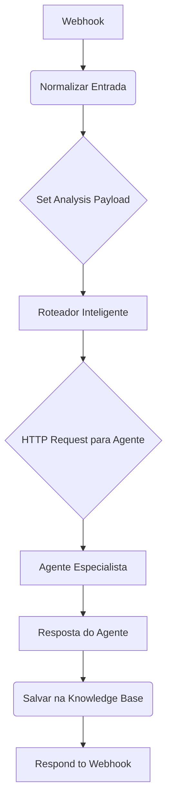

# Guia de Atualização do Orquestrador para IDs Semânticos

**Data:** 08/12/2025  
**Sessão:** #13  
**Objetivo:** Modificar o Orquestrador para gerar e propagar IDs semânticos consistentes.

---

## 🎯 Visão Geral da Mudança

Vamos reestruturar o início do workflow do Orquestrador para que ele gere um ID único e semântico para cada análise, em vez de deixar essa responsabilidade para os agentes ou para o banco de dados.

**Formato do ID Semântico:** `{timestamp}-{territory_id}-{dimension}`  
**Exemplo:** `20251208143000-1721000-economic`

## 📋 Passos de Implementação

### Passo 1: Adicionar Nó "Set" para Gerar Payload

1.  **Abra o workflow** do Orquestrador (`WF-AGENT-ORCHESTRATOR-OrquestradorCentralV3.2(Corrigido).json`).
2.  Logo após o nó **"Normalizar Entrada"**, adicione um novo nó do tipo **"Set"**.
3.  **Renomeie** o nó para: `Set Analysis Payload`.
4.  Configure o nó da seguinte forma:

    *   **Keep Only Set:** `true` (Habilitado)
    *   **Add Field:**

        | Name | Value |
        | :--- | :--- |
        | `analysis_id` | `{{ $now.format("YYYYMMDDHHmmss") }}-{{ $("Webhook - Recebe Requisição").first().json.body.territory_id }}` |
        | `territory_id` | `{{ $("Webhook - Recebe Requisição").first().json.body.territory_id }}` |
        | `territory_name` | `{{ $("Webhook - Recebe Requisição").first().json.body.territory_name }}` |
        | `question` | `{{ $("Webhook - Recebe Requisição").first().json.body.question }}` |
        | `requested_at` | `{{ $now.toISO() }}` |
        | `user_id` | `{{ $("Webhook - Recebe Requisição").first().json.body.user_id || 'system' }}` |

### Passo 2: Atualizar Nó "HTTP Request - Chamar Agente"

1.  Clique no nó **"HTTP Request - Chamar Agente ECON"** (e nos outros agentes).
2.  Vá para a aba **"Body"**.
3.  Substitua o conteúdo do body pela seguinte expressão, que envia o payload completo gerado no passo anterior:

    ```json
    {{ JSON.stringify($json) }}
    ```

    **Importante:** Certifique-se de que a opção **"JSON/Raw"** está selecionada para o `Body Content Type`.

### Passo 3: Atualizar Nó "PostgreSQL - Salvar na Knowledge Base"

1.  Clique no nó **"PostgreSQL - Salvar na Knowledge Base"**.
2.  Atualize a query SQL para usar o `analysis_id` que vem do agente (que por sua vez, veio do Orquestrador).

    **Linha a ser alterada na query:**

    ```sql
    -- ANTES (gerava automaticamente)
    -- gen_random_uuid(),

    -- DEPOIS (usa o ID do payload)
    '{{ $input.first().json.analysis_id }}',
    ```

    **Query Completa Corrigida:**

    ```sql
    INSERT INTO knowledge_base (
      id,
      territory_id,
      dimension,
      analysis_type,
      content,
      summary,
      metadata,
      confidence_score,
      sources,
      created_at,
      updated_at,
      generated_by,
      original_question
    )
    VALUES (
      '{{ $input.first().json.analysis_id }}', -- ID vem do agente
      '{{ $input.first().json.territory_id }}',
      '{{ $input.first().json.dimension || "unknown" }}',
      '{{ $input.first().json.analysis_type || "diagnostic" }}',
      '{{ $input.first().json.analysis_content || "Análise não disponível" }}',
      '{{ $input.first().json.analysis_summary || "" }}',
      jsonb_build_object(
        'question', '{{ $input.first().json.question }}',
        'routed_to', '{{ $("OpenAI - Roteador Inteligente").first().json.message }}',
        'orchestration_timestamp', NOW(),
        'agent_metadata', '{{ $input.first().json.metadata || "{}" }}'::jsonb
      ),
      {{ $input.first().json.confidence_score || 0.80 }},
      '{{ $input.first().json.data_sources || "[]" }}'::jsonb,
      NOW(),
      NOW(),
      'orchestrator-v3.2',
      '{{ $input.first().json.question }}'
    )
    ON CONFLICT (id) DO UPDATE SET
      content = EXCLUDED.content,
      summary = EXCLUDED.summary,
      metadata = EXCLUDED.metadata,
      confidence_score = EXCLUDED.confidence_score,
      sources = EXCLUDED.sources,
      updated_at = NOW(),
      is_latest = TRUE
    RETURNING id, territory_id, dimension, created_at;
    ```

---

## 📈 Diagrama de Fluxo de Dados (Pós-Mudança)



## ✅ Verificação

Após aplicar as mudanças, o `analysis_id` gerado no nó `Set Analysis Payload` deve ser o mesmo que é salvo na `knowledge_base` e enviado para o agente.
