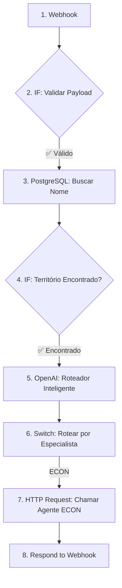

# Guia de Implementação: Workflow do Agente Orquestrador no n8n

**Framework de Inteligência Territorial V6.0**  
**Data:** 01/12/2025  
**Autor:** Manus AI  
**Versão:** 1.0.0

---

## 🎯 1. OBJETIVO

Este documento é um guia prático e detalhado para a implementação do workflow do **Agente Orquestrador** no n8n. Ele descreve a configuração exata de cada nó, as expressões a serem utilizadas e a lógica de fluxo para o **cenário de sucesso** onde a pergunta do usuário é roteada para o **Agente ECON**.

---

## 🌊 2. DIAGRAMA DO FLUXO DE SUCESSO

O fluxo que vamos implementar segue este caminho:



---

## ⚙️ 3. CONFIGURAÇÃO DETALHADA DOS NÓS

A seguir, a configuração exata de cada nó no n8n.

### **Nó 1: Webhook (Start)**

-   **Nome do Nó:** `1. Webhook: Receber Requisição`
-   **Tipo:** `Webhook`
-   **Configuração:**
    -   **Authentication:** `Header Auth`
    -   **Credentials:** Crie uma nova credencial do tipo `Header Auth`.
        -   **Name:** `Auth Concierge`
        -   **Header Name:** `Authorization`
        -   **Header Value:** `Bearer [SEU_TOKEN_SECRETO_AQUI]` (Ex: `Bearer xyz789-super-secret-token-abc123`)
    -   **HTTP Method:** `POST`
    -   **Path:** Será gerado automaticamente pelo n8n (Ex: `webhook/123-abc-xyz`)
    -   **Response Mode:** `Last Node`

**Resultado:** O workflow agora só pode ser acionado por uma requisição POST que contenha o header de autorização correto.

---

### **Nó 2: IF**

-   **Nome do Nó:** `2. IF: Validar Payload`
-   **Tipo:** `IF`
-   **Configuração:**
    -   **Combine:** `All (AND)`
    -   **Conditions:**
        - **Condição 1:**
            - **Value 1:** `{{$json.body.territory_id}}`
            - **Operation:** `Is Not Empty`
        - **Condição 2:**
            - **Value 1:** `{{$json.body.question}}`
            - **Operation:** `Is Not Empty`

**Resultado:** O workflow só continua se os campos `territory_id` e `question` existirem no corpo da requisição. Caso contrário, a execução para (deve-se conectar a saída `false` a um nó de erro 400).

---

### **Nó 3: Postgres**

-   **Nome do Nó:** `3. PostgreSQL: Buscar Nome`
-   **Tipo:** `Postgres`
-   **Configuração:**
    -   **Credential:** Selecione a credencial do seu banco de dados Neon.
    -   **Operation:** `Execute Query`
    -   **Query:**
        ```sql
        SELECT name FROM territories WHERE ibge_code = '{{$json.body.territory_id}}';
        ```

**Resultado:** Este nó executa uma busca no banco de dados para encontrar o nome do município correspondente ao `ibge_code` recebido. O resultado estará disponível em `{{$node["3. PostgreSQL: Buscar Nome"].json.name}}`.

---

### **Nó 4: IF**

-   **Nome do Nó:** `4. IF: Território Encontrado?`
-   **Tipo:** `IF`
-   **Configuração:**
    -   **Conditions:**
        - **Condição 1:**
            - **Value 1:** `{{$node["3. PostgreSQL: Buscar Nome"].json.name}}`
            - **Operation:** `Is Not Empty`

**Resultado:** O workflow só continua se a query anterior tiver retornado um nome para o território. Caso contrário, a execução para (deve-se conectar a saída `false` a um nó de erro 404).

---

### **Nó 5: OpenAI Chat Model**

-   **Nome do Nó:** `5. OpenAI: Roteador Inteligente`
-   **Tipo:** `OpenAI Chat Model`
-   **Configuração:**
    -   **Credential:** Selecione sua credencial da OpenAI.
    -   **Model:** `gpt-4o-mini`
    -   **Messages:**
        - **Role:** `System`
        - **Content:**
          ```
          Você é um roteador de tarefas para um sistema de IA com 4 agentes especialistas. Sua única função é ler a pergunta do usuário e retornar, em uma única palavra, o ID do agente mais apropriado para responder.

          Os agentes disponíveis são:
          - econ: Especialista em economia, PIB, emprego, renda, setores produtivos.
          - social: Especialista em sociedade, IDHM, educação, saúde, demografia, desigualdade.
          - terra: Especialista em território, urbanização, infraestrutura, saneamento, mobilidade.
          - ambient: Especialista em meio ambiente, desmatamento, recursos hídricos, clima, sustentabilidade.

          Retorne APENAS o ID do agente (econ, social, terra, ambient). Não adicione nenhuma outra palavra ou pontuação.
          ```
        - **Role:** `User`
        - **Content:**
          ```
          **Pergunta do Usuário:** "{{$json.body.question}}"
          **Território:** "{{$node["3. PostgreSQL: Buscar Nome"].json.name}}"
          ```

**Resultado:** Este nó envia a pergunta do usuário para o LLM, que retornará uma única palavra: `econ`, `social`, `terra` ou `ambient`. A resposta estará em `{{$node["5. OpenAI: Roteador Inteligente"].json.choices[0].message.content}}`.

---

### **Nó 6: Switch**

-   **Nome do Nó:** `6. Switch: Rotear por Especialista`
-   **Tipo:** `Switch`
-   **Configuração:**
    -   **Input:** `{{$node["5. OpenAI: Roteador Inteligente"].json.choices[0].message.content}}`
    -   **Routing Rules:**
        - **Output 0:** `Equals` -> `econ`
        - **Output 1:** `Equals` -> `social`
        - **Output 2:** `Equals` -> `terra`
        - **Output 3:** `Equals` -> `ambient`

**Resultado:** A execução será direcionada para uma das 4 saídas, de acordo com a resposta do LLM. Para este exemplo, seguiremos a saída `Output 0 (econ)`.

---

### **Nó 7: HTTP Request**

-   **Nome do Nó:** `7. HTTP Request: Chamar Agente ECON`
-   **Tipo:** `HTTP Request`
-   **Conectado a:** Saída `Output 0` do nó Switch.
-   **Configuração:**
    -   **URL:** `[URL_DO_WEBHOOK_DO_AGENTE_ECON]`
    -   **Method:** `POST`
    -   **Authentication:** `Header Auth` (se o agente especialista também for protegido)
    -   **Send Body:** `true`
    -   **Body Content Type:** `JSON`
    -   **Body:**
        ```json
        {
          "agent_id": "econ",
          "territory_id": "{{$json.body.territory_id}}",
          "territory_name": "{{$node['3. PostgreSQL: Buscar Nome'].json.name}}",
          "analysis_type": "comprehensive"
        }
        ```

**Resultado:** Este nó aciona o workflow do Agente ECON, passando um payload completo e validado. Ele aguardará a resposta do Agente ECON antes de prosseguir.

---

### **Nó 8: Respond to Webhook**

-   **Nome do Nó:** `8. Respond to Webhook`
-   **Tipo:** `Respond to Webhook`
-   **Conectado a:** Saída do nó `7. HTTP Request: Chamar Agente ECON`.
-   **Configuração:**
    -   **Response Code:** `200`
    -   **Response Data:** `{{$node["7. HTTP Request: Chamar Agente ECON"].json}}`

**Resultado:** O workflow do Orquestrador é finalizado, retornando ao Agente Concierge a resposta exata que foi recebida do Agente ECON.

---

## ✅ 4. CONCLUSÃO

Seguindo este guia, você terá um workflow robusto e funcional para o Agente Orquestrador. O próximo passo, após a implementação, é realizar testes rigorosos:

1.  **Testes de Validação:** Enviar requisições sem `territory_id` ou `question` para garantir que o erro 400 é retornado.
2.  **Testes de Roteamento:** Enviar perguntas com intenções diferentes para garantir que o Switch está direcionando para o agente correto.
3.  **Teste de Ponta a Ponta:** Realizar uma requisição completa e verificar se a análise gerada pelo Agente ECON é retornada corretamente.

Estou pronto para auxiliar na implementação assim que tivermos as credenciais e URLs necessárias.
